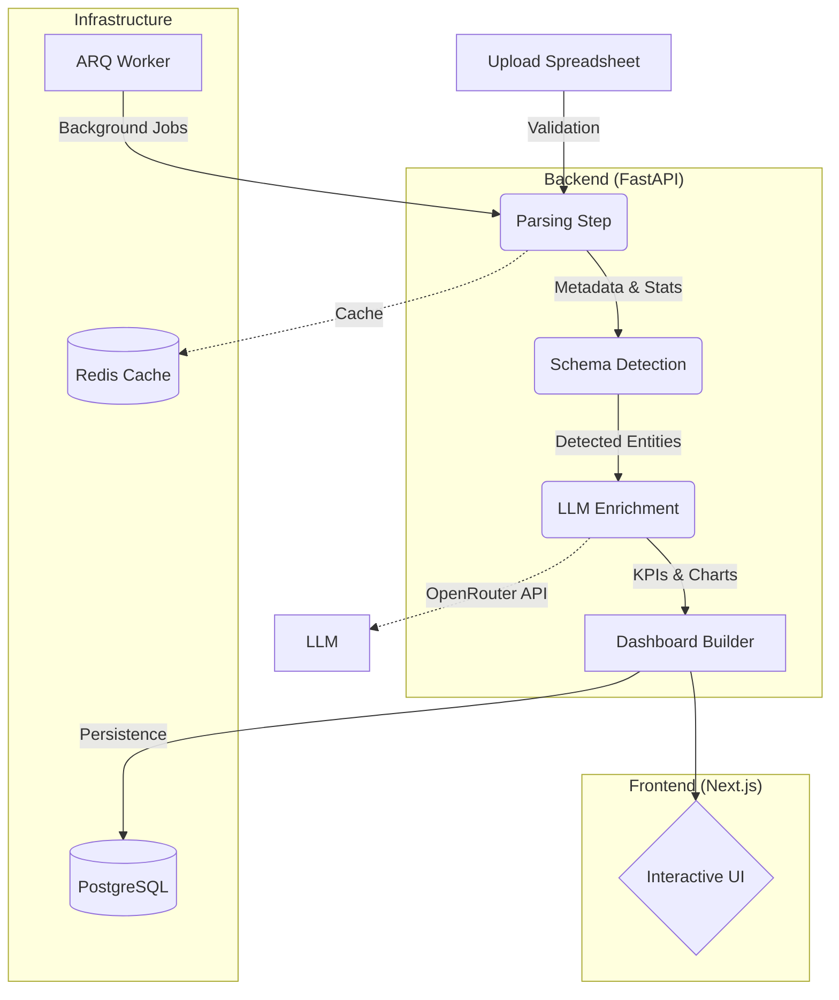

# ExcellentInsight

<div align="center">
  

  <h3>AI-Powered Spreadsheet Intelligence Platform</h3>

  <p>Transform any Excel or CSV file into a comprehensive AI-powered dashboard in under 60 seconds. Zero configuration, instant insights.</p>

  <p>
    
    
    
    
  </p>
</div>

---

## ✨ Features

### 🚀 Core Capabilities
- **Zero-Schema Ingestion:** Upload any spreadsheet format without configuration
- **AI-Powered Analysis:** Automatic KPI detection, trend analysis, and insights
- **Real-Time Processing:** Sub-second analysis with live progress tracking
- **Interactive Dashboards:** Dynamic charts, filters, and drill-down capabilities
- **Multi-Sheet Support:** Automatic relationship detection across sheets
- **Smart Data Types:** Intelligent column type inference and validation

### 🎯 Advanced Features
- **Domain Detection:** Automatic industry/domain classification (Finance, Sales, HR, etc.)
- **Anomaly Detection:** Statistical outlier identification
- **Predictive Metrics:** Trend forecasting and projections
- **Custom Formulas:** User-defined KPI calculations
- **Export & Share:** PDF, Excel, and shareable dashboard links

---

## 🏗️ Architecture & Data Flow



### Tech Stack

- **Backend:** FastAPI (async), SQLAlchemy 2 (asyncpg), ARQ, Pandas
- **Frontend:** Next.js 15, React 19, TailwindCSS 4, Visx
- **Infrastructure:** PostgreSQL 16, Redis 7, Docker
- **LLM Intelligence:** OpenRouter (GPT-4o / Claude 3.5 Sonnet)

---

## 🚀 Quick Start

### 1. Prerequisites
- Docker & Docker Compose
- Node.js 20+ & Python 3.12+ (for local development)

### 2. Configure Environment
```bash
cp .env.example .env
cp frontend/.env.local.example frontend/.env.local

# Edit .env and add your OpenRouter API key
# OPENROUTER_API_KEY=your_key_here
```

### 3. Start Application
```bash
# Recommended: Using Docker Compose
docker-compose up -d

# Services available at:
# - Frontend: http://localhost:3000
# - Backend API: http://localhost:8000
# - API Docs: http://localhost:8000/docs
```

### 4. Database Setup
> [!IMPORTANT]
> To initialize or update your database schema, run the following command:
```bash
alembic upgrade head
```
Alternatively, use our initialization script:
```bash
python scripts/init_db.py
```

---

## 📖 Usage

1. **Upload File:** Drag & drop your Excel/CSV file into the upload zone.
2. **Processing:** Watch the real-time progress tracker as the AI analyzes your data.
3. **Dashboard:** Explore your customized dashboard with automatic KPIs and charts.
4. **Interact:** Filter data, edit AI-suggested formulas, and export reports.

---

## 🧪 Testing & Quality

- **Frontend:** `cd frontend && npm test`
- **Backend:** `pytest -v --cov=app`
- **Linting:** `ruff check .`

---

## 🤝 Contributing

Contributions are welcome! Please fork the repository, created a feature branch, and submit a PR. See [CONTRIBUTING.md](CONTRIBUTING.md) for more details.

---

<div align="center">
  <strong>Built with ❤️ for Data Lovers everywhere.</strong>
</div>
